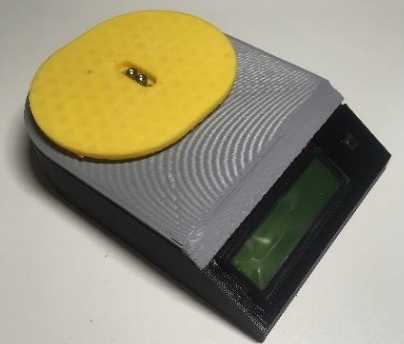

# Open-Source Lab-Grade Scale

> A 3-D printed digital scale built around a strain-gauge load cell, an HX711
> amplifier and an Arduino Nano, with a serial interface for data logging.
> Michigan Tech's MOST lab, published in *Instruments* in 2020, brought into
> the FAST group for further development.

[](https://doi.org/10.3390/instruments4030018)
[](https://www.appropedia.org/Open_Source_Digitally_Replicable_Lab-Grade_Scales)
[](LICENSING.md)



## Overview

The scale is a printed housing that holds a single-point parallel-beam load
cell (a TAL220 for kilogram ranges or a TAL221 for gram ranges), an HX711
24-bit load-cell amplifier, an Arduino Nano, a push-button, and optionally a
16 × 2 LCD. Everything runs from 5 V over USB, so a phone charger or a
computer's USB port powers it. Pressing the button tares the scale and holding
it calibrates against a known mass; over serial, a computer can read, zero,
tare and calibrate it through the Scale Manufacturers Association's SCP-0499
protocol and log its readings continuously. The printed parts locate each other
with bosses and snap joints, so the only fasteners are the load cell's.

It is described in:

> Hubbard BR, Pearce JM (2020). *Open-Source Digitally Replicable Lab-Grade
> Scales.* Instruments 4(3): 18.
> [doi:10.3390/instruments4030018](https://doi.org/10.3390/instruments4030018)

The paper tests three load cells, a 5 kg TAL220 and 500 g and 100 g TAL221s,
against two commercial laboratory balances and against standard masses. It
reports repeatability within 0.05 g for all three, down to a standard deviation
of about 0.005 g for the 100 g cell, readings that track the laboratory balances
linearly, and a parts cost of about USD 51 without an LCD or USD 66 with one
(USD 41 and 47 counting only the parts used out of bulk packs), against USD 110
to 289 for commercial scales with a serial interface.

**Status.** Imported as published. Both firmware targets build with current
tools, the FreeCAD documents and published STLs are checked for integrity, and
the assembly re-exports from FreeCAD 1.1.3 with three of its four bodies
matching the published STLs; the base differs (see
[`cad/README.md`](cad/README.md)). Nothing has been rebuilt or re-tested here,
and nothing has been redesigned yet. See [Known problems](#known-problems).

## Repository layout

- `cad/` — the scale in FreeCAD (base, lid, bed and cover as one parametric
  document), the earlier part files, and the published STLs
  ([details](cad/README.md))
- `firmware/DigitalMassBalance/` — the sketch the paper describes, with the
  libraries it bundles; `firmware/MOST_MassBalance/` — the later library form
  of the same firmware, with its example ([details](firmware/README.md))
- `electronics/` — the Fritzing circuit and its breadboard and schematic views
  ([details](electronics/README.md))
- `bom/` — the paper's bill of materials ([as tables](bom/README.md))
- `docs/` — the [operation guide](docs/operation.md), the
  [breadboard assembly guide](docs/electronics-assembly.md),
  [the paper](docs/paper/), the [datasheets](docs/datasheets/README.md), the
  [test data](docs/test-data/README.md), the
  [serial protocol notes](docs/serial-protocol/README.md), and
  [sources](docs/sources.md) for everything else

## Getting started

You need [arduino-cli](https://arduino.github.io/arduino-cli/), Python 3,
`unzip` and [just](https://github.com/casey/just). FreeCAD 0.18 or later opens
the CAD; it is not needed for the checks.

```sh
just firmware-deps   # install the pinned AVR core and display libraries
just check           # verify the CAD files and build both firmware targets (what CI runs)
just firmware        # build both targets and leave the .hex files under build/firmware/
just stl-stats       # volume and bounding box of every published STL
```

Print `Base.stl`, `Top.stl` and `Bed.stl` (and `Cover.stl` if you want the
draft cover), buy the parts in [`bom/`](bom/README.md), wire them as in
[`electronics/`](electronics/README.md) or follow the
[breadboard guide](docs/electronics-assembly.md), upload
`firmware/DigitalMassBalance` to the Nano (`arduino-cli upload --fqbn
arduino:avr:nano`), and mount the load cell as described in
[`docs/operation.md`](docs/operation.md), which also lists the serial commands.
Section 2.3 of the paper has photographs of the assembly.

## Known problems

Carried over from the published design, not fixed here:

- **Drift after power-on.** The paper observes that the reading drifts
  noticeably when the scale is first switched on, largely with temperature,
  and recommends a warm-up; it has no temperature compensation.
- **The OLED display is unstable on small boards.** Upstream's README says an
  OLED needs more RAM than a Nano has (use a Nano Every or a Mega), and that
  turning an OLED off and straight back on with `XL` can stall the firmware.
- **The housing is light.** The paper notes that the printed housing would
  deform under heavy loads, which side-loads the load cell; higher-capacity
  cells want a stiffer housing.
- **The published `Base.stl` predates the FreeCAD document.** It is 1.25 %
  smaller than the base the document builds, with the same outline; the other
  three STLs match the document (see [`cad/README.md`](cad/README.md)).
- **The paper's sketch is Windows-only as published**: its includes used
  backslashes, fixed here in three one-line commits (see
  [`CHANGELOG.md`](CHANGELOG.md)).
- **Third-party datasheets** are redistributed without a licence statement;
  see [`LICENSING.md`](LICENSING.md).

## Provenance

This repository continues
[mtu-most/most_massbalance](https://gitlab.com/mtu-most/most_massbalance), with
all of its history, and adds the design files published on
[OSF](https://osf.io/me9a8). Three tags mark where it came from:

- `mtu-instruments-2020` — the firmware as published with the paper
- `mtu-final-2021` — upstream's last commit
- `mtu-osf-2020` — the OSF files as published, before they were reorganized

Upstream's own release tags, `v3.0.0` to `v3.4.0`, are kept. The scale builds
on Benjamin Hubbard's earlier
[OS Nano Balance](https://github.com/brhubbar/OS_Nano_Balance); see
[`docs/sources.md`](docs/sources.md). [`CHANGELOG.md`](CHANGELOG.md) lists
everything changed since.

## Citation

If you use this scale, please cite the paper above. GitHub's **Cite this
repository** button gives it, from [`CITATION.cff`](CITATION.cff).

## License

This repository is licensed by component: the firmware, design files, circuit
and test data are `GPL-3.0-or-later`, the bundled libraries `MIT` and
`LGPL-2.1-or-later`, the paper and the guides adapted from it `CC-BY-4.0`,
the Appropedia material `CC-BY-SA-4.0`, and the datasheets state none.
[`LICENSING.md`](LICENSING.md) states what applies where, including the
questions still open.

## Contact

Maintained by the [FAST research group](https://uwo-fast.github.io/). For
research collaboration inquiries, contact Dr. Joshua Pearce
(<joshua.pearce@uwo.ca>).
