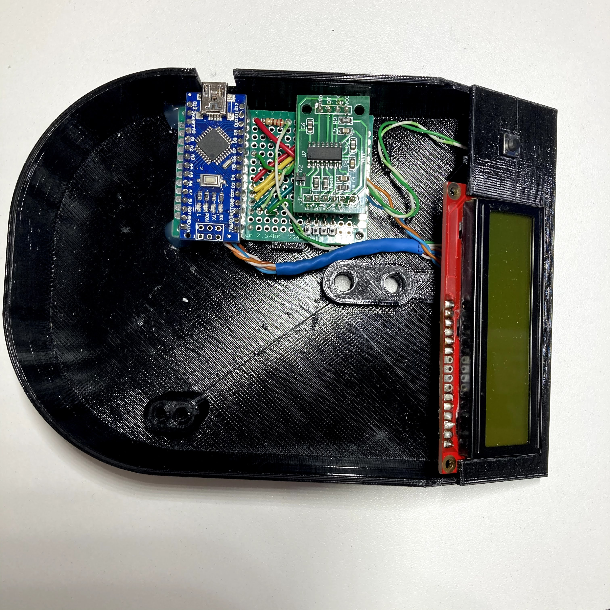
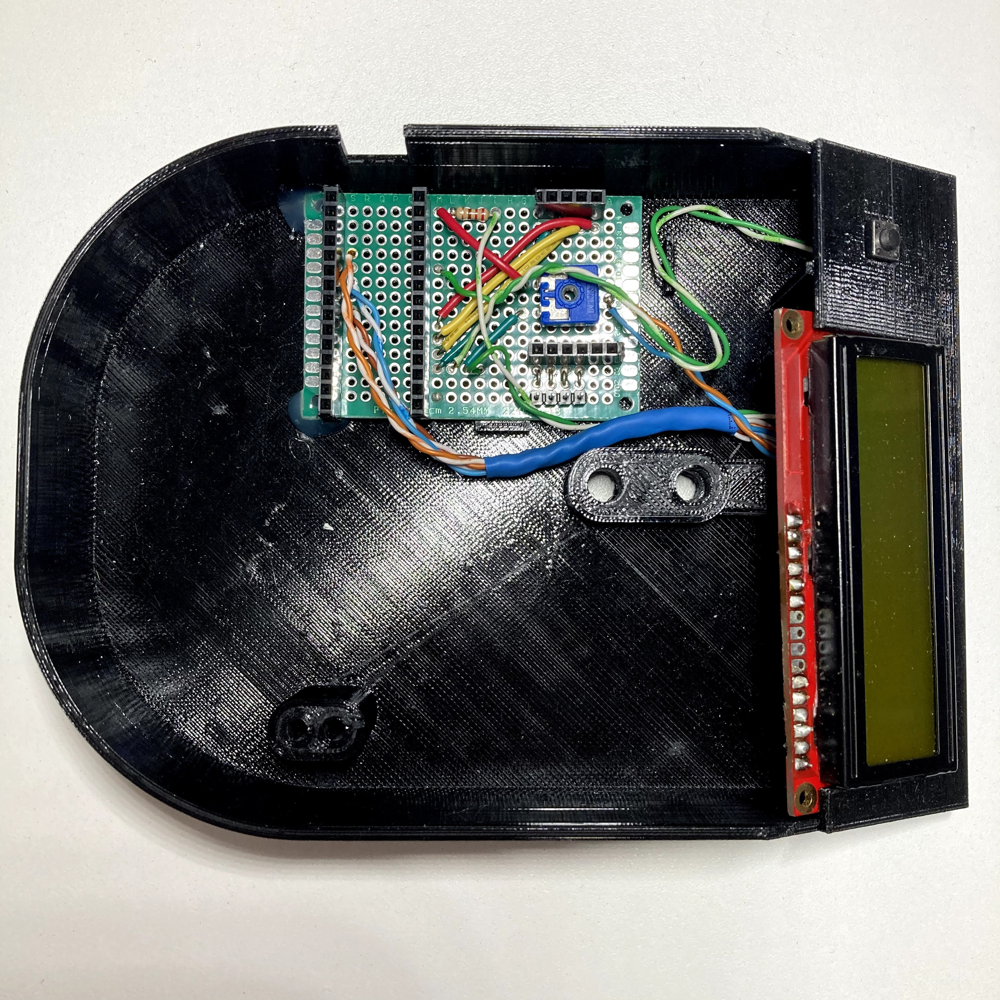

# Assembling the electronics on a solder breadboard

Adapted from the "Electronics Assembly" section of the Appropedia page
[Open Source Digitally Replicable Lab-Grade Scales](https://www.appropedia.org/Open_Source_Digitally_Replicable_Lab-Grade_Scales),
written by Benjamin Hubbard in February 2021 (`CC-BY-SA-4.0`). Text marked
**Note** is added here.

This is one way to wire the scale on a 4 × 6 cm solder breadboard, the way the
third scale was assembled. It follows the schematic in
[`../electronics/`](../electronics/README.md). The breadboard is a grid whose
pads are named by a letter on one axis and a number on the other, as in the
game of Battleship; the pad names below locate every part.

## Required items

- 4 × 6 cm solder breadboard
- 200 mm (8″) lengths of twisted pair, as from Cat 5 cable:
  - 2 × green / green-white
  - 1 × blue / blue-white
  - 1 × orange / orange-white
  - 1 × brown / brown-white
  - 1 × blue / orange
- 22 AWG solid-core wire:
  - 2 × 40 mm (1.5″) yellow
  - 1 × 20 mm (1″) green
  - 3 × 30 mm (1.25″) green
  - 1 × 40 mm (1.5″) green
  - 1 × 25 mm (1″) red
  - 1 × 45 mm (1.75″) red
  - 4 × 8 mm (0.25″) bare
- 220 Ω resistor
- 10 kΩ trimmer potentiometer
- Female header pins: 2 × 15-pin, 1 × 6-pin, 1 × 4-pin
- Male header pins: 1 × 4-pin
- 16 × 2 LCD
- Normally-open push-button
- Heat shrink: 1 × 45 mm (cut in half), 3 × 45 mm, 5 × 45 mm

**Note:** the header counts here differ from the paper's Table 1, which lists
the parts of an earlier build; see [`../bom/`](../bom/README.md).

## Install the header pins

Solder the headers onto the breadboard as listed.

| Female header | Breadboard position |
| --- | --- |
| 15 × 1 | T0–T14 |
| 15 × 1 | N0–N14 |
| 6 × 1 | A4–F4 |
| 4 × 1 | B14–E14 |

| Male header | Breadboard position |
| --- | --- |
| 4 × 1 | C1–F1 |

Finally, use the four bare pieces of wire to connect the four male header pins
to their four neighbours on the 6 × 1 female header. The other two receivers on
that header (A4 and B4) are not used; they are there to locate the HX711
amplifier.

## Install the potentiometer

A potentiometer has three pins: 1 (fixed), 2 (wiper) and 3 (fixed). Here pin 1
is ground, pin 2 the output and pin 3 Vcc.

- Pin 1 (GND): F7
- Pin 2 (wiper): B8
- Pin 3 (Vcc): F9

## Install the jumper wires

This uses all the 22 AWG solid-core wires except the three 30 mm green ones.
The jumpers connect pins that are already installed to other installed pins:
each is run to a pad next to the pin of interest, and its extra lead is bent
over to touch the solder on that pin so the two can be soldered together. In
the table, each end is written `pad to insert into: pad to solder to`.

| Wire | End 1 | End 2 |
| --- | --- | --- |
| Green 40 mm | E13: E14 | M3: N3 |
| Yellow 40 mm | D13: D14 | M4: N4 |
| Yellow 40 mm | C13: C14 | M5: N5 |
| Red 45 mm | B13: B14 | M6: N6 |
| Green 20 mm | L3: M3 | G7: F7 |
| Red 25 mm | M14: N14 | G9: F9 |
| 220 Ω resistor | L14: M14 | I14 |

## Wire the button

Connect one of the green / green-white twisted pairs to the pins of the button,
covering the exposed wire with the two pieces of 1 mm heat shrink. The other
ends are attached to the breadboard last, because the button has to be
installed in place in the scale's housing.

## Wire the LCD

The LCD has 16 pins, numbered 1 (VSS) to 16 (LED−), as in the schematic. It is
wired with all the remaining twisted pairs and the three 30 mm pieces of green
solid-core wire.

1. Take the green / green-white pair. Connect one end of all three solid-core
   wires to one end of the green wire, making a three-wire pigtail, and cover
   the joint with the 3 mm heat shrink. This grounds the LCD.
2. Connect the three pigtail ends to pins 1, 5 and 16 of the LCD, and the
   matching end of the green-white wire to pin 15. The other end of this pair
   will go to the board to power the backlight.
3. Brown / brown-white pair: brown to 14, brown-white to 13.
4. Blue / blue-white pair: blue to 12, blue-white to 11.
5. Orange / orange-white pair: orange to 6, orange-white to 4.
6. Blue / orange pair: blue to 3, orange to 2.
7. Green / green-white pair: green to K3: L3, green-white to H14: I14.

Without shrinking it, slip the 5 mm heat shrink over the four single-colour
twisted pairs (leave the blue / orange pair free). **Do not shrink it yet.** It
will hold the wires together and out of the way of the load cell once the board
is complete.

Now attach the LCD to the breadboard, keeping in mind how the wires will lie in
the housing (dry-fit before cutting to length). The notation is the same as for
the jumpers: insert into the first pad, solder to the second. Soldering the pad
the wire is inserted into as well gives extra strength.

1. Blue / orange pair: blue to A8: B8, orange to F10: F9.
2. Brown / brown-white pair: brown to S6: T6, brown-white to S7: T7.
3. Blue / blue-white pair: blue to S8: T8, blue-white to S9: T9.
4. Orange / orange-white pair: orange to S10: T10, orange-white to S11: T11.

With the wires in place and lying properly in the housing, heat the heat shrink
to fix their shape and keep them off the load cell.

## Finish installing the button

This is the most awkward step, which is why this twisted pair has extra length.

1. Feed the green / green-white pair from the button through the hole in the
   face of the housing.
2. Connect green to J3: K3 and green-white to M10: N10.

## Install the board and LCD

If not already done, seat the LCD in its slot in the housing, routing its wires
around the load-cell boss. If any wire rests against the load cell, reliable
measurements are impossible. Seat the breadboard so that the Nano's USB port
will be reachable through the slot in the base; if it is not held tightly, hot
glue on two or three corners secures it.

## Finishing up

Put the Arduino Nano onto the two 15 × 1 headers and load a sketch that drives
only the LCD and prints something on it. (With the scale firmware, comment out
the initialisation of the balance, load cell and HX711 for this step, since the
HX711 is not installed yet and the firmware would wait for it.) The LCD is now
powered, but probably shows nothing legible: turn the potentiometer with a
screwdriver until the text is clearly visible. This sets the contrast and does
not need adjusting again.

Power down, plug the HX711 into the other female header, and install a load
cell, connecting it to the four male header pins.

The scale should now work. For the mechanical assembly and the load-cell
mounting, see Section 2.3 of the paper in [`paper/`](paper/), and for using the
scale, [`operation.md`](operation.md).
